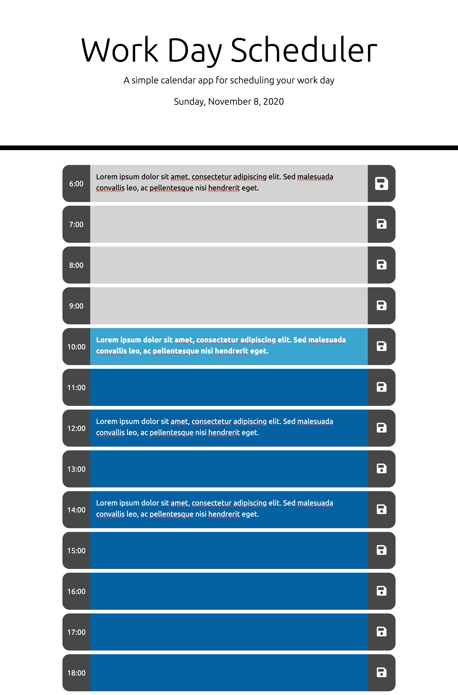
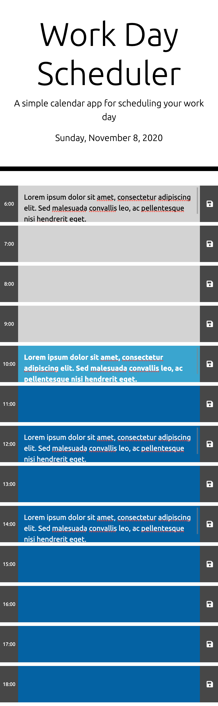

# Day Planner

## Description

Day planner that allows the user to enter content into a textarea for a specific timeslot between the hours of 6:00 and 18:00 of the current day (date displayed at the top of the page). The user can save the entered content to local storage by clicking the corresponding save button of the timeslot. Upon refreshing the page, the content is automatically rendered to the page in the appropriate timeslot where the user had previously entered the content.

[View deployed project](https://jkole822.github.io/Day-Planner/)

## Visuals

### Display on Large Screen

### Display on Small Screen

